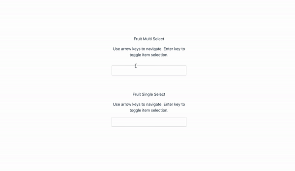

# headless-combobox



## ⚠️ WORK IN PROGRESS ⚠️

But I (the author) am using in my personal and professional projects.

## Pros

- 🧠 Headless. Bring your own styles.
- 🔌 Framework agnostic. Bring your own framework.
- ⚡️ Zero dependencies
- ♿️ [WAI ARIA Combobox](https://www.w3.org/WAI/ARIA/apg/patterns/combobox/) support
- 🧺 Multi Select supported
- 💪 Written in TypeScript
- 🌳 Simple pure functional [Elm](https://elm-lang.org/)-like API
- 💼 Works anywhere JavaScript works.
  - React Native
  - Vue
  - Node.js
  - Redux (Since the API is just pure functions)
  - Any legacy JS framework
  - etc.

## Cons

- 🧠 Headless. You do have to write your own styles.
- 🔌 Framework agnostic. You do have to write glue code. Which could be error prone
- 🌳 [Elm](https://elm-lang.org/)-like API. Some people may hate that.
- 📚 Missing good documentation.
- 🧪 Missing automated tests. (This is one is on the agenda)

## Good use cases are

- You need a custom looking combobox
- You're working in a legacy framework
- You're working in a framework with a small ecosystem
- You're working in a framework that always has breaking changes
- You hate learning how to override styles in combobox libraries

## Links

- [Svelte Example](https://headless-combobox-example-svelte.vercel.app/)
- [API Reference](https://headless-combobox.vercel.app/)
- [Github](https://github.com/crvouga/headless-combobox)
- [NPM](https://www.npmjs.com/package/headless-combobox)

## Installation

### NPM

```shell
npm install headless-combobox
```

### Yarn

```shell
yarn add headless-combobox
```

### PNPM

```shell
pnpm install headless-combobox
```

## Complementary Libraries

- [match-sorter](https://github.com/kentcdodds/match-sorter) for filtering items
- [floating-ui](https://floating-ui.com/) for rendering the drop down.

## Usage

### Svelte Multi Select

```svelte
<script lang="ts">
  import * as Combobox from "headless-combobox";

  /*


  Step 0: Have some data


  */

  type Item = { id: number; label: string };
  const fruits: Item[] = [
    { id: 0, label: "pear" },
    { id: 1, label: "apple" },
    { id: 2, label: "banana" },
    { id: 3, label: "orange" },
    { id: 4, label: "strawberry" },
    { id: 5, label: "kiwi" },
    { id: 6, label: "mango" },
    { id: 7, label: "pineapple" },
    { id: 8, label: "watermelon" },
    { id: 9, label: "grape" },
  ];

  let selectedItems: { [itemId: string]: HTMLElement } = {};
  let items: { [itemId: string]: HTMLElement } = {};
  let input: HTMLInputElement | null = null;

  /*


  Step 1: Init the config


  */

  const config = Combobox.initConfig<Item>({
    toItemId: (item) => item.id,
    toItemInputValue: (item) => item.label,
  });

  /*


  Step 2: Init the state


  */

  let model = Combobox.init({
    allItems: fruits,
    mode: { type: "multi-select" },
  });

  /*


  Step 3: Write some glue code


  */

  const dispatch = (msg: Combobox.Msg<Item>) => {
    const output = Combobox.update(config, { msg, model });

    model = output.model;

    Combobox.runEffects(output, {
      focusSelectedItem: (selectedItem) => {
        selectedItems[selectedItem.id]?.focus();
      },
      focusInput: () => {
        input?.focus();
      },
      scrollItemIntoView: (item) => {
        items[item.id]?.scrollIntoView({ block: "nearest" });
      },
    });

    console.log(msg.type, output.model.type);
  };

  const handleKeyDown = (event: KeyboardEvent) => {
    const msg = Combobox.browserKeyboardEventKeyToMsg<Item>(event.key);
    if (msg.shouldPreventDefault) {
      event.preventDefault();
    }
    dispatch(msg);
  };

  /*


  Step 3: Wire up to the UI


  */

  $: state = Combobox.toState(config, model);
</script>

<div>
  <label
    class="label"
    {...state.aria.inputLabel}
    for={state.aria.inputLabel.for}
  >
    Fruit Multi Select
  </label>

  <div class="input-container" on:keydown={handleKeyDown}>
    <p {...state.aria.helperText}>
      {Combobox.ariaContentDefaults.helperText}
    </p>

    <ul class="chip-list" {...state.aria.selectedList}>
      {#each state.selections as selectedItem}
        <li
          {...state.aria.selectedItem(selectedItem)}
          bind:this={selectedItems[selectedItem.id]}
          class="chip"
          class:chip-highlighted={state.isSelectedItemFocused(selectedItem)}
          on:focus={() =>
            dispatch({ type: "focused-selected-item", item: selectedItem })}
        >
          {selectedItem.label}
          <span
            {...state.aria.unselectButton(selectedItem)}
            class="chip-delete-btn"
            on:mousedown|preventDefault={() =>
              dispatch({ type: "pressed-unselect-button", item: selectedItem })}
          >
            &times;
          </span>
        </li>
      {/each}
    </ul>

    <input
      {...state.aria.input}
      class="input"
      value={state.inputValue}
      bind:this={input}
      on:input={(event) =>
        dispatch({
          type: "inputted-value",
          inputValue: event.currentTarget.value,
        })}
      on:click={() => dispatch({ type: "pressed-input" })}
      on:focus={() => dispatch({ type: "focused-input" })}
      on:blur={() => dispatch({ type: "blurred-input" })}
    />
    <ul
      {...state.aria.itemList}
      class="suggestions"
      class:hide={!state.isOpened}
    >
      {#if state.items.length === 0}
        <li>No results</li>
      {/if}
      {#each state.items as item, index}
        <li
          {...state.aria.item(item)}
          bind:this={items[item.id]}
          on:mousemove={() => dispatch({ type: "hovered-over-item", index })}
          on:mousedown|preventDefault={() =>
            dispatch({ type: "pressed-item", item })}
          on:focus={() => dispatch({ type: "hovered-over-item", index })}
          class="option"
          class:highlighted={state.itemStatus(item) === "highlighted"}
          class:selected={state.itemStatus(item) === "selected"}
          class:selected-and-highlighted={state.itemStatus(item) ===
            "selected-and-highlighted"}
        >
          {config.toItemInputValue(item)}
        </li>
      {/each}
    </ul>
  </div>
</div>

<style>
  .input-container {
    position: relative;
    width: 100%;
    max-width: 300px;
  }

  .label {
    position: relative;
    display: block;
    width: 100%;
    margin: auto;
  }

  .hide {
    display: none;
  }
  .input {
    width: 100%;

    font-size: large;
    padding: 0.5rem;
    box-sizing: border-box;
    border: 1px solid #ccc;
  }
  .suggestions {
    position: absolute;
    top: 100%;
    left: 0;
    right: 0;
    z-index: 1;
    width: 100%;
    max-height: 200px;
    overflow: scroll;
    border: 1px solid #ccc;
    width: 100%;
    max-width: 100%;
    margin: 0;
    padding: 0;
    background: #efefef;
  }

  @media (prefers-color-scheme: dark) {
    .suggestions {
      background: #121212;
    }
  }

  .option {
    display: block;
    cursor: pointer;
    list-style: none;
    width: 100%;
    font-size: large;
    margin: 0;
    padding: 0;
  }

  .highlighted {
    background-color: #333;
    color: white;
  }

  @media (prefers-color-scheme: dark) {
    .highlighted {
      background-color: #eee;
      color: black;
    }
  }

  .selected {
    background-color: blue;
    color: white;
  }
  .selected-and-highlighted {
    background-color: lightblue;
  }

  .chip-list {
    display: flex;
    flex-direction: row-reverse;
    flex-wrap: wrap-reverse;
  }
  .chip {
    display: flex;
    align-items: center;
    padding: 0.5rem;
    margin: 0.5rem;
    gap: 0.5rem;
    background: #efefef;
    border-radius: 0.5rem;
    height: 1.5rem;
    cursor: default;
    font-size: large;
  }
  .chip-highlighted {
    background: #333;
    color: white;
  }

  .chip-delete-btn {
    font-size: medium;
    background: transparent;
    padding: 4px;
    border-radius: 100%;
    cursor: pointer;
  }

  @media (prefers-color-scheme: dark) {
    .chip {
      background: #121212;
    }
  }
</style>
```
